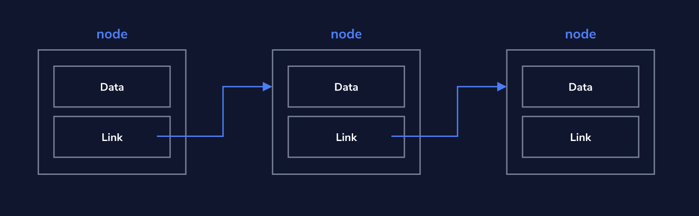

# Linked Lists

### The Concept of a Linked List

A linked list is a series of nodes that are connected together. A node has data and a link to another node. The __head node__ refers to the first node of the Linked List. The data structure of a linked lists is a foundation for more complex data structures. Since the nodes use links to denote the next node in the sequence, the nodes are not required to be sequentially located in memory. The links can either be unidirectional by only pointing to the next node or bidirectional by point to the previous node, too. 



Common operations on a linked list may include:

- adding nodes
- removing nodes
- finding a node
- traversing the linked list

__Adding a new node__ to the beginning of the list requires you to link your new node to the current head node. This way, you maintain your connection with the following nodes in the list.

__Removing a node__ requires you to adjust the pointers. The previous node should point to the next node. That way, the middle node gets "orphaned" and essentially deleted. 

### Linked Lists implemented in Python

First, define a class that represents a `Node`:

```python
class Node:

  def __init__(self, value, next_node=None):
    self.value = value
    self.next_node = next_node

  def get_value(self):
    return self.value

  def get_next_node(self):
    return self.next_node

  def set_next_node(self, next_node):
    self.next_node = next_node
```

In this example we will implement four methods for our representation of the linked list:

- Get the head node of the list (it’s like peeking at the first item in line)
- Add a new head node
- Iterate over the linked list
- remove a node that has a particular value

```python
class LinkedList:
  def __init__(self, value=None):
    self.head_node = Node(value)
  
  def get_head_node(self):
    return self.head_node
  
  def insert_beginning(self, new_value):
    new_node = Node(new_value)
    new_node.set_next_node(self.head_node)
    self.head_node = new_node
    
  def iterate_and_yield_values(self):
    current_node = self.get_head_node()
    while current_node:
      yield current_node.get_value()
      current_node = current_node.get_next_node()

  def remove_node(self, value_to_remove):
  	for node in iterate_and_yield_values():
  		next_node = node.get_next_node()
  		if next_node.get_value() == value_to_remove:
  			node.set_next_node(next_node.get_next_node())
```

