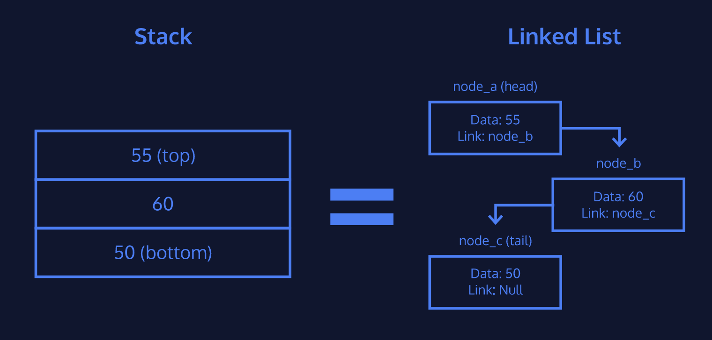

# Stacks

### The concept of a Stack

Pile data onto one another and you get a stack. Stacks have a _"Last In, First Out"_ (or LIFO) structure. This means that only the "top node" can be retrieved. You may constrain a Stack by its size. Attempting to push data onto a full stack will result in a __stack overflow.__ Similarly, attempting to pop data from an empty stack will result in a __stack underflow.__

Stacks provide three methods for interaction:

- __Push:__ Add data to the “top” of the stack.
- __Pop:__ Return and remove data from the “top” of the stack.
- __Peek:__ Return data from the “top” of the stack without removing it.

